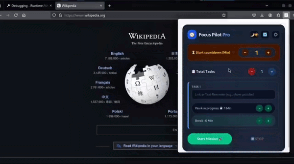

# 🧠 Focus Pilot

### An Intelligent Browser Extension for Mitigating Attention Fragmentation in High-Cognitive Digital Workflows

<p align="center">


</p>

<p align="center">
  <em>
    Focus is no longer a matter of willpower.
    It is a matter of architecture.
  </em>
</p>

---

---


<p align="center">



</p>

<p align="center">
<b>Watch Focus Pilot actively guide your workflow through intelligent interventions, automatic task launches, countdown alerts, and focus checkpoints.</b>
</p>

---

# 📖 Overview

**Focus Pilot** is a next-generation browser extension engineered to eliminate attention fragmentation during deep work, software development, intensive research, academic study, and other knowledge-intensive workflows.

Unlike traditional productivity tools that rely on passive timers and voluntary compliance (which users can easily ignore), **Focus Pilot introduces an Active Intervention Model** that intelligently injects contextual prompts, task checkpoints, and temporal enforcement mechanisms directly into the browser workflow.

Instead of simply reminding users to stay focused, Focus Pilot actively guides attention by transforming the browser itself into an intelligent productivity assistant.

The project explores a simple yet powerful hypothesis:

> **"Human focus is rarely lost because we forget our goals. It is lost because digital environments continuously compete for our attention."**

Rather than relying solely on self-discipline, Focus Pilot redesigns the interaction layer between users and their digital workspace.

---

## 📥 Install the Extension

<p align="center">

<a href="https://addons.mozilla.org/en-US/firefox/addon/focus-pilot-pro/" target="_blank">


</a>

</p>

---

# 🎥 Live Demonstration

<p align="center">


</p>

<p align="center">
<b>Focus Pilot actively intervenes in your workflow to help maintain deep focus.</b>
</p>

---

# 📷 User Interface

<p align="center">


</p>

---

# 👁️ Built on the Science of the 20-20-20 Rule

According to optometrists, prolonged screen exposure can cause digital eye strain and visual fatigue.

The internationally recommended **20-20-20 Rule** helps reduce this strain:

- 👀 Every **20 Minutes**
- ⏳ Look away for **20 Seconds**
- 🌳 Focus on an object approximately **20 Feet Away**

This allows the eye muscles to relax and reduces fatigue during extended computer use.

---

# 🛡️ How Focus Pilot Enforces This

Unlike ordinary reminder applications that display small notifications, **Focus Pilot actively intervenes** to ensure healthy work intervals.

### 🚀 Smart Launch

At the end of every focus interval, Focus Pilot automatically opens your configured task, URL, or reminder, keeping your workflow synchronized without requiring manual intervention.

### 🔊 Pre-Task Alert

During the final **10 seconds** of every session, a loud countdown alarm is triggered to prepare you for the next focus cycle.

This minimizes missed sessions and keeps your workflow disciplined.

---

---

### 📖 Read the Backstory & Design Philosophy
Want to know why and how I built **Focus Pilot Pro**? Check out the detailed articles published on top developer communities:

*   🌐 **Read on Dev.to:** [How I built an open-source browser guardrail to save my eyes and focus](https://dev.to/nahidmahmud555/how-i-built-an-open-source-browser-guardrail-to-save-my-eyes-and-focus-manifest-v3-1dnk)
*   🌐 **Read on Hashnode:** [How I built an open-source browser guardrail to save my eyes and focus](https://focus-pilot.hashnode.dev/how-i-built-an-open-source-browser-guardrail-to-save-my-eyes-and-focus-manifest-v3)

Your feedback and stars are highly appreciated! ⭐

---

# 🎯 Why Focus Pilot Exists

Modern browsers have become the primary operating environment for:

- 👨‍💻 Software Developers
- 🔬 Researchers
- 🎓 Students
- 🚀 Founders
- 📚 Knowledge Workers

Unfortunately, the same environment also contains countless sources of distraction:

- Infinite scrolling
- Social media interruptions
- Context switching
- Notification overload
- Tab explosion
- Cognitive fatigue

Most productivity applications respond with:

- Timers
- Passive reminders
- Notification popups
- Static schedules

The problem is simple.

When a notification appears—

**Users can ignore it.**

When cognitive fatigue accumulates—

**Passive systems become ineffective.**

Focus Pilot explores a different approach.

> **Active In-Context Intervention**

Instead of relying entirely on willpower, the browser itself becomes an intelligent assistant capable of guiding attention exactly when it matters most.

---

# 🏛️ Project History

Focus Pilot has continuously evolved from a simple productivity timer into a browser-native attention management framework.

The development process has been guided by practical observations of how developers, students, researchers, and knowledge workers actually interact with modern browsers.

---

## 🚀 Phase I — Initial Launch (April 2026)

The earliest version of Focus Pilot was developed as a lightweight productivity extension centered around structured work intervals.

### Core Characteristics

- Fixed minute-based work sessions
- Linear task scheduling
- Static break periods
- Basic reminder architecture
- Local browser persistence

### Limitations Discovered

Although effective for conventional study sessions, the original architecture struggled with modern digital workflows.

Challenges included:

- Rapid development cycles
- Research-heavy browsing
- Quick reference lookups
- Dynamic task switching
- Short productivity bursts
- Frequent workflow interruptions

The original system assumed work followed predictable schedules.

Real-world workflows proved otherwise.

---

## 🚀 Phase II — Architectural Reconstruction (July 2026)

The project underwent a complete architectural redesign.

Rather than behaving as a simple timer, Focus Pilot evolved into a browser-native attention management framework capable of actively assisting users throughout their workflow.

### Major Improvements

### ✅ Dynamic Task Injection

Tasks, reminders, goals, and URLs can now be injected into an active session without restarting the workflow.

---

### ✅ State Preservation Engine

Critical runtime information remains synchronized even after popup closures, browser refreshes, or temporary interface interruptions.

---

### ✅ Live Runtime Updates

Operational settings can be modified while a mission remains active.

No restart required.

---

### ✅ Micro-Sprint Framework

Support for ultra-short productivity cycles enables:

- Memory refresh sessions
- Flashcard reviews
- Visual recovery breaks
- Cognitive reset moments
- Pomodoro micro-sprints

---

### ✅ Improved Session Reliability

Enhanced local state synchronization significantly reduces accidental configuration loss and unexpected session resets.

---

# 🔬 What Makes Focus Pilot Different?

Most productivity applications treat focus as a timer problem.

Focus Pilot treats focus as an interaction design problem.

Instead of relying on passive reminders, the extension actively participates in the user's workflow through intelligent interventions.

| Category | Traditional Productivity Apps | Focus Pilot |
|-----------|------------------------------|-------------|
| Focus Model | Passive Reminder | Active Intervention |
| Task Updates | Restart Required | Live Runtime Injection |
| Workflow Adaptation | Static | Dynamic |
| Browser Awareness | Limited | Native Extension Layer |
| Session Persistence | Basic | State Preservation Engine |
| Cognitive Checkpoints | Minimal | Integrated |
| Micro-Sprint Support | Rare | Built-In |
| Runtime Updates | Limited | Live Configuration |
| Workflow Guidance | Manual | Automated |

---

# 🧠 Core Design Philosophy

Focus Pilot is built around four fundamental principles.

---

## 1️⃣ Attention Is a Limited Resource

Attention should be protected before it is lost.

The extension focuses on preventing distraction rather than recovering from it.

---

## 2️⃣ Friction Can Be Useful

Small, intentional interruptions can prevent much larger distractions later.

Properly timed interventions encourage healthier digital habits.

---

## 3️⃣ Context Matters

Reminders are significantly more effective when delivered inside the active workflow rather than through isolated notifications.

Focus Pilot integrates directly into the browser experience.

---

## 4️⃣ Systems Beat Motivation

Motivation naturally fluctuates.

Well-designed systems remain consistent.

Focus Pilot emphasizes structured environments over temporary bursts of motivation.

---

# ⚙️ Key Features

## 🚀 Dynamic Live Task Injection

Inject tasks, reminders, URLs, or objectives into active sessions without restarting.

---

## 🧩 Session Persistence Engine

Automatically preserves workflow state across popup closures, reloads, and browser events.

---

## ⏱️ Micro-Sprint Framework

Supports ultra-short attention cycles for rapid cognitive reinforcement.

Perfect for:

- Flashcards
- Code reviews
- Reading sessions
- Memory recall
- Eye-rest breaks

---

## 📋 Multi-Task Workflow Support

Manage multiple focus objectives simultaneously while maintaining a structured workflow.

---

## 🔄 Runtime Configuration Updates

Modify schedules, intervals, alarms, and settings while sessions continue running.

---

## 🌐 Browser-Native Experience

Purpose-built for modern browser-based work environments.

Designed specifically for:

- Developers
- Researchers
- Students
- Writers
- Designers
- Knowledge workers

---

## 🔔 Intelligent Alerts

Loud countdown notifications prepare users before each intervention begins.

---

## 👁️ 20-20-20 Rule Enforcement

Automatically encourages healthy screen habits through active interval management.

---

# 🏗️ Technical Architecture

```text
                    ┌──────────────────────────────┐
                    │        Popup Interface       │
                    │   Tasks • Settings • Timer   │
                    └──────────────┬───────────────┘
                                   │
                                   ▼
                    ┌──────────────────────────────┐
                    │ Background Service Worker    │
                    │ Session State Management     │
                    └──────────────┬───────────────┘
                                   │
                                   ▼
                    ┌──────────────────────────────┐
                    │ Dynamic Task Injection Core  │
                    │ Runtime Event Controller     │
                    └──────────────┬───────────────┘
                                   │
                                   ▼
                    ┌──────────────────────────────┐
                    │ Active Browser Environment   │
                    │ Contextual Focus Overlays    │
                    └──────────────────────────────┘
```

---

# 🛠️ Technology Stack

## 🎨 Frontend

- HTML5
- CSS3
- JavaScript (ES6+)

---

## 🌐 Browser APIs

- Chrome Extension API
- Firefox Extension API
- Storage API
- Runtime Messaging API
- Tabs API
- Alarms API

---

## 🏗️ Architecture

- Manifest V3
- Event-Driven Design
- Background Service Workers
- Local State Synchronization
- Runtime Task Injection
- Browser-Native Workflow Management

---

## 📂 Project Structure

```text
Focus-Pilot/
│
├── assets/
├── icons/
├── popup/
├── background/
├── scripts/
├── styles/
├── manifest.json
└── README.md
```

---

# 📦 Installation

Focus Pilot is compatible with all Chromium-based browsers and Mozilla Firefox.

---

## 🌐 Chromium Browsers

Supported browsers include:

- Google Chrome
- Microsoft Edge
- Brave Browser
- Opera
- Vivaldi

### 1️⃣ Clone the Repository

```bash
git clone https://github.com/Nahid-mahmud555/focus-pilot-pro-official.git
```

---

### 2️⃣ Navigate to Extensions

```text
chrome://extensions
```

---

### 3️⃣ Enable Developer Mode

Turn on **Developer Mode** from the top-right corner.

---

### 4️⃣ Load the Extension

Click:

```text
Load Unpacked
```

Then select the project directory.

---

## 🦊 Firefox Installation

### 1️⃣ Open

```text
about:debugging
```

---

### 2️⃣ Select

```text
This Firefox
```

---

### 3️⃣ Click

```text
Load Temporary Add-on
```

---

### 4️⃣ Choose

```text
manifest.json
```

The extension is now ready to use.

---

# 📥 Download Focus Pilot Pro

Prefer a ready-to-use version?

<p align="center">

<a href="https://full-f.vercel.app/">


</a>

</p>

Or install directly from Mozilla Add-ons:

<p align="center">

<a href="https://addons.mozilla.org/en-US/firefox/addon/focus-pilot-pro/" target="_blank">


</a>

</p>
---

# 📚 Potential Use Cases

## 🎓 Students

- Study planning
- Revision sessions
- Exam preparation
- Flashcard review
- Reading assignments

---

## 👨‍💻 Developers

- Coding sprints
- Debugging sessions
- Documentation review
- Deep programming sessions
- Learning new technologies

---

## 🔬 Researchers

- Literature review
- Academic paper analysis
- Reference collection
- Knowledge synthesis
- Long reading sessions

---

## 🚀 Founders & Builders

- Product development
- Strategic planning
- Startup execution
- Market research
- Business documentation

---

## ✍️ Writers

- Blog writing
- Technical documentation
- Book writing
- Research notes
- Content planning

---

## 🎨 Designers

- UI/UX workflow
- Design review
- Creative sessions
- Portfolio building

---

# 🔮 Future Roadmap

## 🚀 Version 4.x

- Smart Adaptive Scheduling
- AI-Assisted Workflow Suggestions
- Focus Analytics Dashboard
- Session Heatmaps
- Smart Notification Intelligence
- Website Blocking
- Productivity Insights
- Enhanced Browser Automation

---

## 🌍 Long-Term Vision

Focus Pilot aims to become a browser-native cognitive operating layer capable of assisting users in:

- Attention management
- Workflow orchestration
- Context switching
- Productivity optimization
- Digital wellbeing
- Intelligent browser automation

---

# 🤝 Contributing

Contributions are always welcome.

Whether you're fixing bugs, improving documentation, suggesting features, or optimizing performance, every contribution helps improve Focus Pilot.

### Development Workflow

```bash
Fork Repository
      ↓
Create Branch
      ↓
Commit Changes
      ↓
Push Branch
      ↓
Open Pull Request
```

---

# 👨‍💻 Author

## Nahid Mahmud

**Founder & Principal Architect**

Department of Computer Science & Engineering

Varendra University

### Research Interests

- Human–Computer Interaction (HCI)
- Cognitive Systems
- Productivity Engineering
- Browser-Native Productivity
- Attention Management Frameworks
- Digital Wellbeing Systems

---

# 📬 Contact

For collaborations, feature requests, bug reports, academic discussions, or research inquiries:

📧 **Email**

```text
tohidul07890@gmail.com
```

---

# ⭐ Support The Project

If you find Focus Pilot useful, consider supporting the project.

⭐ Star the repository

🍴 Fork the project

🐞 Report bugs

💡 Suggest features

🔧 Submit Pull Requests

📢 Share the project

Every contribution helps build a better browser productivity ecosystem.

---

# 📄 License

Licensed under the **MIT License**.

Copyright © 2026 Nahid Mahmud

Permission is hereby granted, free of charge, to any person obtaining a copy of this software and associated documentation files (the "Software"), to deal in the Software without restriction, including without limitation the rights to use, copy, modify, merge, publish, distribute, sublicense, and/or sell copies of the Software.

---

# 🌟 Acknowledgements

Special thanks to the open-source community and everyone who believes that technology should empower human attention rather than compete for it.

---

<p align="center">

# 🧠 Focus Pilot

### Building systems that protect attention in a world designed to fragment it.

<br>

⭐ **If you enjoyed this project, don't forget to Star the repository!**

</p>

---

<p align="center">

Made with ❤️ by <b>Nahid Mahmud</b>

</p>
